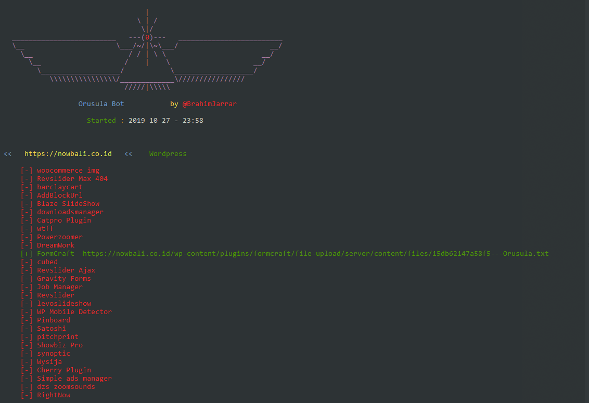

<h1 align="center">
  <br>
  <a href="https://github.com/Squuv">
    
  </a>
  </br>
  <br>
  Orusula
  </br>
</h1>

<h4 align="center">
  <br>Orusula 🕷️ is An Intelligent Bot Auto Shell Exploit and detect multiple types of Cms</br>
</h4>

<p align="center">
   <a href="https://github.com/Squuv/">
    
  </a>

  <a href="https://pypi.org/project/Orusula/">
    
  </a>

  <a href="https://github.com/Squuv/">
      
  </a>
  <a href="https://travis-ci.com/Squuv/Orusula">
    
  </a>
  <br></br>
  
</p>

<p align="center">
  <a href="https://github.com/Squuv/Orusula/wiki">Orusula Wiki</a> •
  <a href="https://github.com/Squuv/Orusula/wiki/Usage">How To Use</a> •
  <a href="https://github.com/Squuv/Orusula/wiki/Compatibility-&-Dependencies">Compatibility</a> •
  <a href="https://github.com/Squuv/Orusula/wiki/Orusula-Library">Library</a> •
</p>

-------------------------------------

### _🕷️ Features_

- Detect cms (wordpress, joomla, prestashop, drupal, opencart, magento, lokomedia)
- Target informations gatherings
- Multi-threading on demand
- Checks for vulnerabilities
- Auto shell injector
- Exploit dork searcher

-------------------------------------

#### Joomla
- [x] [Com Jce            ]('#')
- [x] [Com Jwallpapers    ]('#')
- [x] [Com Jdownloads     ]('#')
- [x] [Com Jdownloads2    ]('#')
- [x] [Com Weblinks       ]('#')
- [x] [Com Fabrik         ]('#')
- [x] [Com Fabrik2        ]('#')
- [x] [Com Jdownloads Index]('#')
- [x] [Com Foxcontact     ]('#')
- [x] [Com Blog           ]('#')
- [x] [Com Users          ]('#')
- [x] [Com Ads Manager    ]('#')
- [x] [Com Sexycontactform]('#')
- [x] [Com Media          ]('#')
- [x] [Mod_simplefileupload]('#')
- [x] [Com Facileforms    ]('#')
- [x] [Com Facileforms    ]('#')
- [x] [Com extplorer      ]('#')

#### Wordpress
- [x] [AddBlockUrl]('#')
- [x] [Revslider Max]('#')
- [x] [barclaycart]('#')
- [x] [woocommerce]('#')
- [x] [Blaze SlideShow]('#')
- [x] [downloadsmanager]('#')
- [x] [Catpro Plugin]('#')
- [x] [wtff]('#')
- [x] [Powerzoomer]('#')
- [x] [FormCraft]('#')
- [x] [DreamWork]('#')
- [x] [cubed]('#')
- [x] [Gravity Forms]('#')
- [x] [Revslider Ajax]('#')
- [x] [Job Manager]('#')
- [x] [levoslideshow]('#')
- [x] [WP Mobile Detector]('#')
- [x] [Satoshi]('#')
- [x] [Pinboard]('#')
- [x] [Pitchprint]('#')
- [x] [Showbiz Pro]('#')
- [x] [Synoptic]('#')
- [x] [Cherry Plugin]('#')
- [x] [Wysija]('#')
- [x] [Simple ads manager]('#')
- [x] [dzs zoomsounds]('#')
- [x] [RightNow]('#')

#### Opencart
- [ ] [Opencart BruteForce]('#')

### _🕷️ Available command line options_

    usage: Orusula [options]

      -h, --help            show this help message and exit
      -u , --url            Target site
      -l , --list           list of sites urls
      -d , --dorks          dorks to get sites list. Soon
      -s , --scan           Cms scanner
      -t , --threads        Threading by default 10

-------------------------------------

###   Install Orusula on Ubuntu

```bash
$ git clone https://github.com/BrahimJarrar/Orusula.git
$ cd Orusula
$ chmod +x install.sh
$ ./install.sh
```


###   Install Orusula on Termux

```BASH
$ pkg update
$ pkg install -y git
$ git clone https://github.com/BrahimJarrar/Orusula.git
$ cd Orusula
$ chmod +x install.sh
$ ./install.sh
```


###   Install Orusula in Windows

- [click here](https://github.com/BrahimJarrar/Orusula/archive/master.zip) to download Orusula
- download and install python3
- unzip **Orusula-master.zip** in ***Desktop***
- open the command prompt **cmd**.
```
> cd Desktop/Orusula-master/
> python Orusula.py
```


-------------------------------------

### 💙 Imported scripts

- [x] [Cms Checker](https://github.com/anouarbensaad/vulnx)
- [x] [5 Joomla exploits](https://github.com/anouarbensaad/vulnx)
- [x] [README.md xD](https://github.com/anouarbensaad/vulnx)

-------------------------------------

### :warning: Warning!

***I Am Not Responsible of any Illegal Use!***

-------------------------------------

### _🕷️ Contribution & License_

You can contribute in following ways:

- [Report bugs & add issues](https://github.com/BrahimJarrar/Orusula/issues/new)
- Search for new vulnerability
- Develop plugins
- Searching Exploits
- Give suggestions **(Ideas)** to make it better

Do you want to have a conversation in private? Discord : **Squuv#0420**

***Orusula*** is licensed under [GPL-3.0 License](https://github.com/BrahimJarrar/Orusula/blob/master/LICENSE)
